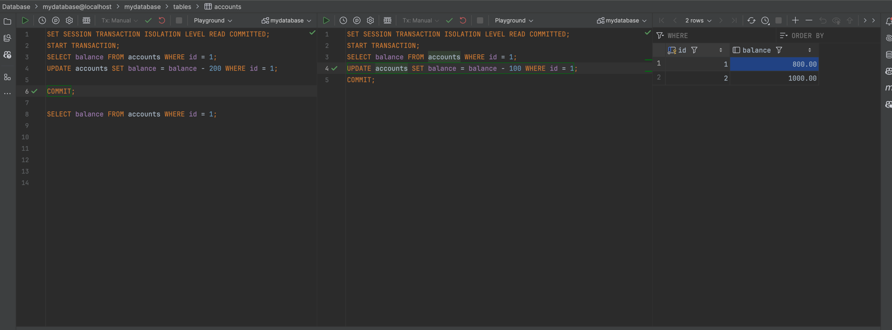
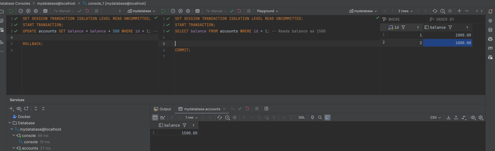
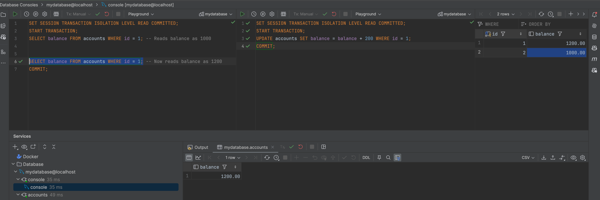
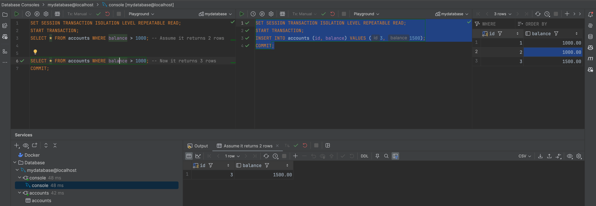

# Isolations & locks

## Set up percona and postgre and create an InnoDB table.

```docker-compose
version: '3.8'

services:
  percona:
    image: percona:latest
    container_name: percona_db
    platform: linux/amd64
    environment:
      MYSQL_ROOT_PASSWORD: root_password
      MYSQL_DATABASE: mydatabase
      MYSQL_USER: myuser
      MYSQL_PASSWORD: mypassword
    ports:
      - "3306:3306"
    volumes:
      - percona_data:/var/lib/mysql
    networks:
      - my_network

  postgres:
    image: postgres:latest
    container_name: postgres_db
    platform: linux/amd64
    environment:
      POSTGRES_USER: myuser
      POSTGRES_PASSWORD: mypassword
      POSTGRES_DB: mydatabase
    ports:
      - "5432:5432"
    volumes:
      - postgres_data:/var/lib/postgresql/data
    networks:
      - my_network

volumes:
  percona_data:
  postgres_data:

networks:
  my_network:
    driver: bridge

```

## By changing isolation levels and making parallel queries, reproduce the main problems of parallel access:

- Create a table with two accounts for the demonstration:

```sql
CREATE TABLE accounts (
    id INT PRIMARY KEY,
    balance DECIMAL(10,2)
);

INSERT INTO accounts (id, balance) VALUES (1, 1000.00), (2, 1000.00);
```

---

### lost update

> Lost update occurs when two transactions read the same data and update it concurrently, with one update being lost.

- Transaction 1 (Session 1):

```sql
SET SESSION TRANSACTION ISOLATION LEVEL READ COMMITTED;
START TRANSACTION;
SELECT balance FROM accounts WHERE id = 1;
UPDATE accounts SET balance = balance - 200 WHERE id = 1;

```

- Transaction 2 (Session 2):

```sql
SET SESSION TRANSACTION ISOLATION LEVEL READ COMMITTED;
START TRANSACTION;
SELECT balance FROM accounts WHERE id = 1;
UPDATE accounts SET balance = balance - 100 WHERE id = 1;
COMMIT;
```

- Back to Transaction 1 (Session 1):

```sql
COMMIT;
```

- Check Final Balance:

```sql
SELECT balance FROM accounts WHERE id = 1;
```

> Expected Result: The balance should be 700, but due to the lost update, you may still see 800 because the update from Transaction 2 is overwritten by Transaction 1.



---

### dirty read

> Dirty read occurs when a transaction reads data that has been modified by another transaction but not yet committed.

- Transaction 1 (Session 1):

```sql
SET SESSION TRANSACTION ISOLATION LEVEL READ UNCOMMITTED;
START TRANSACTION;
UPDATE accounts SET balance = balance + 500 WHERE id = 1; -- Balance becomes 1500
```

- Transaction 2 (Session 2):

```sql
SET SESSION TRANSACTION ISOLATION LEVEL READ UNCOMMITTED;
START TRANSACTION;
SELECT balance FROM accounts WHERE id = 1; -- Reads balance as 1500
```

- Rollback Transaction 1 (Session 1):

```sql
ROLLBACK;
```

- Transaction 2 (Session 2):

```sql
COMMIT;
```

> Expected Result: Transaction 2 reads the uncommitted balance (1500), which gets rolled back, causing a dirty read.



---

### non-repeatable read

> Non-repeatable read occurs when a transaction reads the same row twice and gets different values each time because another transaction modified and committed the row in the meantime.

- Transaction 1 (Session 1):

```sql
SET SESSION TRANSACTION ISOLATION LEVEL READ COMMITTED;
START TRANSACTION;
SELECT balance FROM accounts WHERE id = 1; -- Reads balance as 1000
```

- Transaction 2 (Session 2):

```sql
SET SESSION TRANSACTION ISOLATION LEVEL READ COMMITTED;
START TRANSACTION;
UPDATE accounts SET balance = balance + 200 WHERE id = 1;
COMMIT;
```

- Back to Transaction 1 (Session 1):

```sql
SELECT balance FROM accounts WHERE id = 1; -- Now reads balance as 1200
COMMIT;
```

> Expected Result: Transaction 1 sees different values for the same row in its two queries, demonstrating a non-repeatable read.



---

### phantom read

> Phantom read occurs when a transaction reads a set of rows that satisfy a condition, but another transaction inserts or deletes rows that also satisfy the condition before the first transaction is complete.

- Transaction 1 (Session 1):

```sql
SET SESSION TRANSACTION ISOLATION LEVEL REPEATABLE READ;
START TRANSACTION;
SELECT * FROM accounts WHERE balance > 1000; -- Assume it returns 2 rows
```

- Transaction 2 (Session 2):

```sql
SET SESSION TRANSACTION ISOLATION LEVEL REPEATABLE READ;
START TRANSACTION;
INSERT INTO accounts (id, balance) VALUES (3, 1500);
COMMIT;
```

- Back to Transaction 1 (Session 1):

```sql
SELECT * FROM accounts WHERE balance > 1000; -- Now it returns 3 rows
COMMIT;
```

> Expected Result: Transaction 1 sees a different set of rows on the second query due to the insert by Transaction 2, demonstrating a phantom read.



